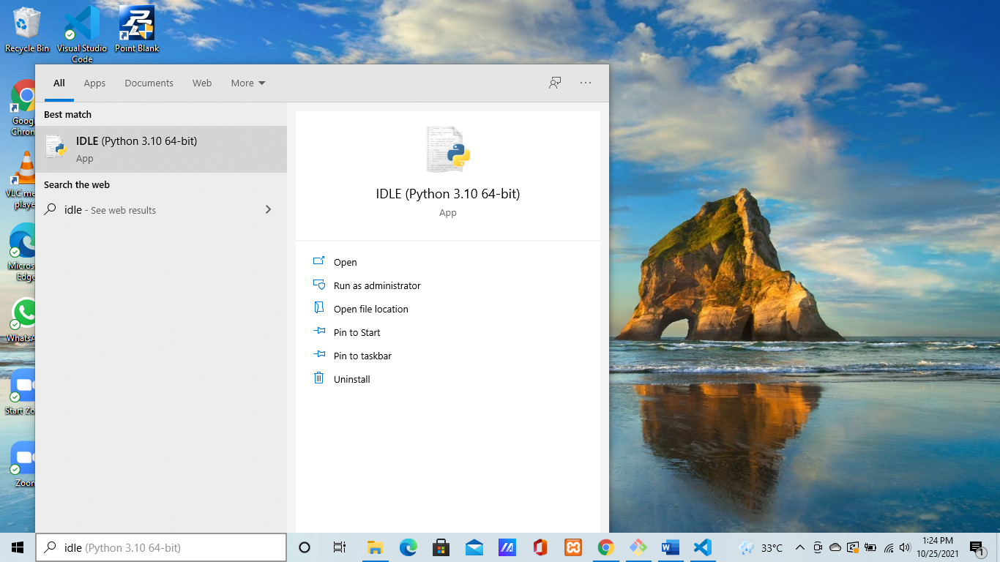
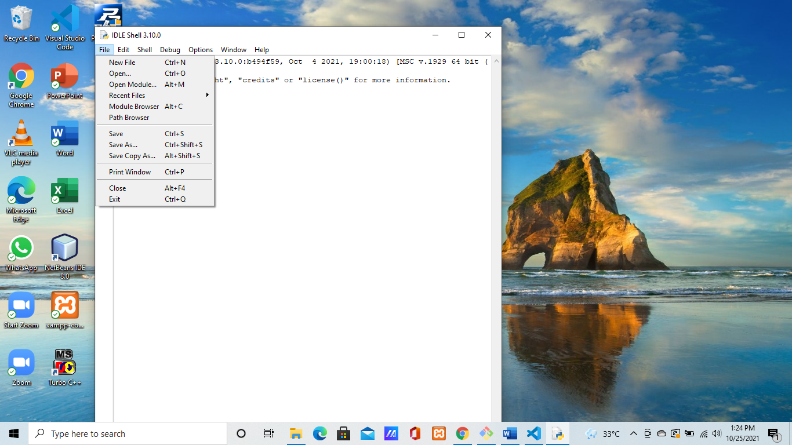
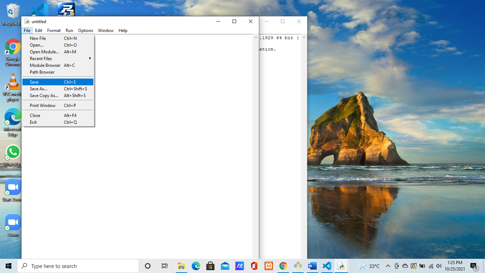
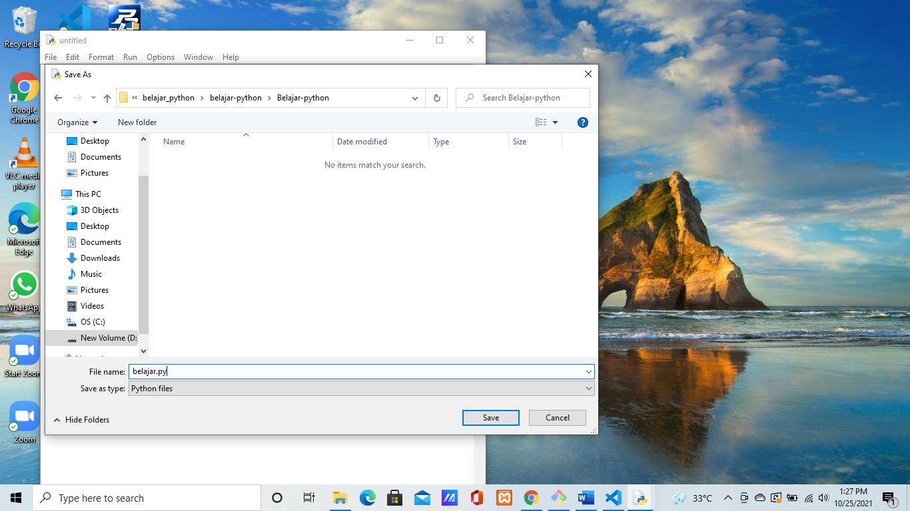
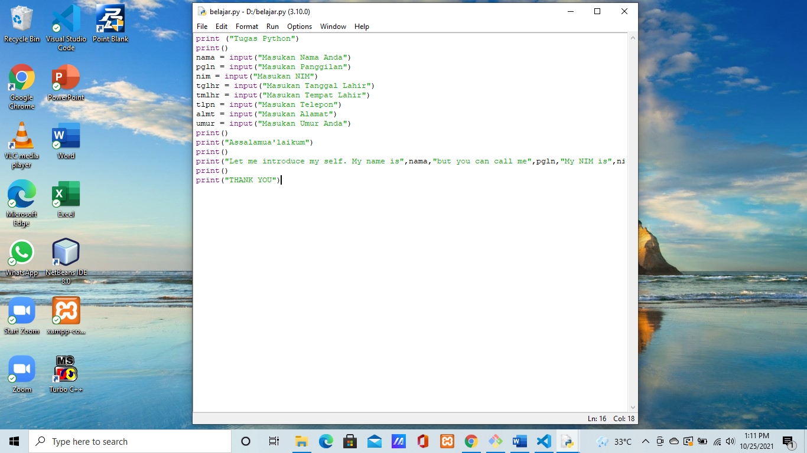
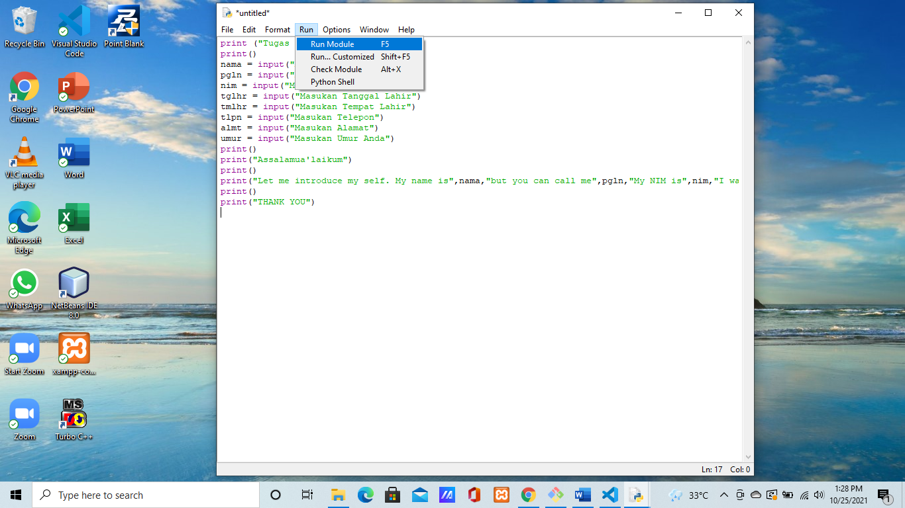
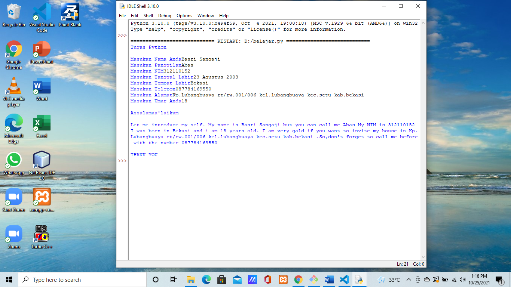

# belajar-python
## Cara Input Menggunakan Python
- buka IDLE Python di pencarian 

- Klik (File - New File) 

- Setelah itu Klik (File - Save) 

- Lalu pilih tempat untuk menyimpan file Python "JANGAN LUPA MENGGUNAKAN .py" 

- Koding sesuai apa yang kalian mau 

- Setelah selesai koding, lalu pilih (Run - Run Module) untuk menjalankan program 

## OUTPUT
